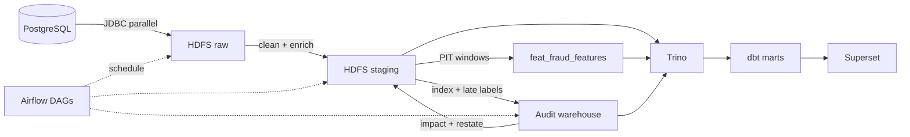

# Fintech Fraud Detection — Auditable Batch Data Platform

Enterprise batch lakehouse cho fraud detection tại fintech: từ PostgreSQL đến dashboard,
có **late-arriving fraud labels**, **idempotent restatement**, và **reconciliation invariant = 0**.

> Built an auditable batch fraud intelligence platform with point-in-time feature engineering,
> idempotent late-label restatements, source-to-warehouse reconciliation, historical report
> versioning and an explainable investigation queue.

---

## Numbers that shipped

| Metric | Value | Why it matters |
|---:|---:|---|
| Transactions in staging | **13,305,915** | Full multi-year payment history on HDFS |
| Fraud labels joined | **8,914,963** | Was `is_fraud = NULL` for the entire lake — now populated |
| Confirmed fraud (`is_fraud = true`) | **13,332** | Ground truth ready for ML & investigation |
| Transaction index rows | **13,305,915** | O(partition) lookup for selective restatement |
| Fraud-label history (baseline) | **8,914,963** | Knowledge-time ledger (not just event-time) |
| Reconciliation `unexplained_difference` | **0** | `raw − dup = accepted + quarantined` holds |
| PIT smoke (`2018-06-15`) | **4,005** features | Self-leakage removed from velocity windows |
| Late-label demo (`2018-12-25`) | **0 → 1** fraud · **+$51.12** | 1 partition restated; recon still **0** |
| Years covered | **2010 → 2019** | Static dataset backfill, partition pruned |

### The `is_fraud = NULL` rescue

| Before | After |
|---|---|
| 13.3M staging rows, **0** labels | **8,914,963** labeled |
| Broadcast / sort-merge OOM on 8.9M × 13.3M | Hash-batched materialize + co-partitioned joins on 2GB executors |

---

## Tech stack

| Layer | Tool |
|---|---|
| Source | PostgreSQL 14 |
| Processing | Apache Spark 3.5 (PySpark) |
| Storage | HDFS 3.2 + HOT/WARM/COLD policies |
| Catalog | Hive Metastore 3.1 |
| Query | Trino 435 |
| Transform | dbt-trino 1.7 |
| Orchestration | Airflow 2.8 |
| BI | Superset 3.1 |
| Runtime | Docker Compose (WSL2-friendly) |

---

## Architecture



### Two times, one truth

| Clock | Meaning |
|---|---|
| **Event time** | When the payment happened (`transaction_date`) |
| **Knowledge time** | When the fraud label became known (`knowledge_date`) |

Late chargebacks update history **without rewriting the whole lake** — only impacted `year/month/day` partitions.

---

## What makes this project different

1. **Auditable late labels** — `fraud_label_history` + `fraud_label_impact_manifest` + `applied_change_ledger`
2. **Idempotent restatement** — re-run safe; already-`APPLIED` change_ids are skipped
3. **Before / after report snapshots** — `AS_PREVIOUSLY_REPORTED` vs `RESTATED`
4. **Hard reconciliation invariant** — `unexplained_difference = 0` (dbt-tested)
5. **Point-in-time features** — a transaction never enters its own velocity / user-avg windows
6. **Explainable investigation queue** — heuristic `risk_score` + `reason_codes` (CONFIRMED_FRAUD, HIGH_VELOCITY_1H, …)
7. **PCI-DSS** — CVV dropped in-memory at ingestion; never lands on disk

---

## Demo — Day 1 report → Day 3 late fraud label

Spec story from `BATCH_FRAUD_INTELLIGENCE.md`, **executed on this lake** via
`scripts/demo_late_label_story.py`:

| Step | Result |
|---|---|
| Victim transaction | `22293015` |
| Event date (Day 1) | **2018-12-25** — Christmas Day cohort |
| Knowledge date (Day 3) | **2020-01-03** |
| Day-1 daily fraud report | **0** fraud txn · **$0.00** · 4,164 payments that day |
| Day-3 after late label `No → Yes` | **1** fraud txn · **$51.12** |
| Delta | **+1** fraud · **+$51.12** |
| Partitions rewritten | **1** (`year=2018/month=12/day=25` only — not the full lake) |
| Changes applied (ledger) | **1** |
| Reconciliation | `unexplained_difference = **0**` · `invariant_ok = true` |
| Restore | Staging fraud count back to **0** (demo is idempotent / reversible) |

### What this proves

1. Historical report on Day 1 stays honest (**0 fraud** that day).  
2. When knowledge arrives on Day 3, only the **impacted partition** is restated.  
3. Before/after economics are auditable (**+$51.12** fraud amount).  
4. Source→staging accounting still balances (**unexplained = 0**).

### Re-run the demo

```bash
cd ~/momo-fraud-detection-de-pipeline
git pull
zip -r pipeline.zip ingestion/ transformation/ config/ quality/ scripts/ \
    -x "*.pyc" -x "*/__pycache__/*"

docker exec -e PROJECT_ROOT=/opt/spark/work-dir spark-master \
  /opt/spark/bin/spark-submit \
  --master spark://spark-master:7077 \
  --py-files /opt/spark/work-dir/pipeline.zip \
  /opt/spark/work-dir/scripts/demo_late_label_story.py \
  2>&1 | tee /tmp/demo_late_label.log

grep -A 20 "DEMO_METRICS\|DONE" /tmp/demo_late_label.log
```

---

## Airflow DAGs

| DAG | Role |
|---|---|
| `fraud_data_pipeline` | Daily ingest → staging → features → dbt |
| `fraud_auditable_batch_pipeline` | Index → detect labels → restate → recon → PIT features → audit marts |
| `compaction_pipeline` | Tiering / compaction |

> Do not run both core DAGs for the **same** `ds` concurrently — they write the same staging partitions.

---

## Quick start

```bash
make download-jars && make copy-data
make up
make airflow-install-dbt   # once
make hdfs-init && make hive-init
make hive-audit-init       # auditable tables
make pipeline              # full backfill
make superset-init         # optional
```

**Notes for this stack**

- Spark ↔ Hive Metastore: use client `spark.sql.hive.metastore.version=2.3.9` with `jars=builtin` (server is still HMS 3.1.3).
- HiveServer2 Thrift `:10000` is optional / flaky on WSL — DDL & MSCK go through **Spark SQL**.
- dbt in Airflow: copy project to `/tmp/dbt` (bind-mount of `/home/airflow/dbt` can be stale).

### Service URLs

| Service | URL |
|---|---|
| HDFS | http://localhost:9870 |
| Spark | http://localhost:8081 |
| Trino | http://localhost:8082 |
| Airflow | http://localhost:8083 (`admin`/`admin`) |
| Superset | http://localhost:8088 (`admin`/`admin`) |

---

## Repository map

| Path | Role |
|---|---|
| `ingestion/` | JDBC parallel extract → HDFS raw |
| `transformation/staging/` | Clean, enrich, fraud-label join |
| `transformation/warehouse/` | Dims + **PIT** fraud features |
| `transformation/audit/` | Index, late labels, restate, reconcile |
| `dbt/models/` | Staging / warehouse / marts + investigation queue |
| `airflow/dags/` | `fraud_data_pipeline`, `fraud_auditable_batch_pipeline` |
| `scripts/demo_late_label_story.py` | End-to-end late-label story with metrics |
| `BATCH_FRAUD_INTELLIGENCE.md` | Product / invariant spec |

---

## Data quality

- Quarantine path for invalid amounts (parser flags)
- dbt test `assert_reconciliation_invariant` → fails if `unexplained_difference ≠ 0`
- Integration test `tests/integration/test_point_in_time_features.py` → proves no self-leakage in windows

---

## Docs

- `BATCH_FRAUD_INTELLIGENCE.md` — event time vs knowledge time, demo acceptance
- `README_UPGRADE.md` — how the audit overlay fits the existing lakehouse
- `myReadme.md` — engineering decision log
